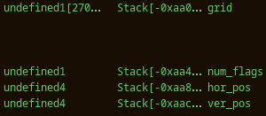

Hello fellow hackers! Today we are attempting the [babygame01](https://play.picoctf.org/practice/challenge/345?category=6&originalEvent=72&page=1) challenge from picoCTF 2023. This is a binary exploitation challenge that involves underflowing a buffer to modify a value on the stack to satisfy the condition of an if statement.

## Getting Started

### Preliminary Static Analysis

More information on the executable is obtained using the `file` binary. It is a non-stripped ELF 32-bit executable built for GNU/Linux.

```bash
file game
game: ELF 32-bit LSB executable, Intel 80386, version 1 (SYSV), dynamically linked, interpreter /lib/ld-linux.so.2, BuildID[sha1]=85fcad170460434c915b5ad675a351a2778e24bb, for GNU/Linux 3.2.0, not stripped
```

The security features of the executable are assessed using the `checksec` binary.

```bash
checksec game
[*] '/home/kali/ctf/picoCTF_2023/babygame01/game'
    Arch:     i386-32-little
    RELRO:    Partial RELRO
    Stack:    Canary found
    NX:       NX enabled
    PIE:      No PIE (0x8048000)
```

The result is analysed below.

- `Partial RELRO`: the GOT and PLT are partially read-only at runtime
- `Canary found`: stack canaries in place, which makes overriding the return address of a function by causing a buffer overflow more difficult
- `NX enabled`: the stack is marked as non executable
- `No PIE`: the binary is loaded at the same memory address every time it is executed

### Preliminary Dynamic Analysis

The executable is then run to gain a better understanding of the challenge.

```bash
./game
Player position: 4 4
End tile position: 29 89
Player has flag: 0
..........................................................................................
..........................................................................................
..........................................................................................
..........................................................................................
....@.....................................................................................
..........................................................................................
..........................................................................................
..........................................................................................
..........................................................................................
..........................................................................................
..........................................................................................
..........................................................................................
..........................................................................................
..........................................................................................
..........................................................................................
..........................................................................................
..........................................................................................
..........................................................................................
..........................................................................................
..........................................................................................
..........................................................................................
..........................................................................................
..........................................................................................
..........................................................................................
..........................................................................................
..........................................................................................
..........................................................................................
..........................................................................................
..........................................................................................
.........................................................................................X
```

A grid is printed to the screen with a `@` character representing the player position and a `X` representing the end tile position. The player and end tile position are also displayed above the grid, with the first number being the vertical position and the second number being the horizontal position. The third value indicates the amount of flags the player has. The position of the player can be modified by passing the characters below to stdin to arrive at the end tile. When the end tile is reached, the `You win!` message is printed.

- `w`: move up by one position
- `s`: move down by one position
- `a`: move left by one position
- `d`: move right by one position

## Reversing with Ghidra

The binary is opened in the reverse engineering software [Ghidra](https://ghidra-sre.org/) and analysed with the default options.

### The `main` function

The decompilation of the `main` function is presented below, with the important variables renamed. The game is initialised on lines 16, 17 and 18. The main game loop spans over lines 20 to 26. The condition to exit the main game loop is to have the position of the player be that of the end tile. The game logic consists in getting a player move from stdin, updating the player position and printing the grid. Once the end tile is reached and the main game loop exits, the flag is printed if the `num_flags` variable is non-zero. Hence the challenge can be solved by:

- setting the `num_flags` variable to a non-zero value
- having the player and end tile position be the same

```c
undefined4 main(void)

{
  int move;
  undefined4 uVar1;
  int in_GS_OFFSET;
  int ver_pos;
  int hor_pos;
  char num_flags;
  undefined grid [2700];
  int local_14;
  undefined *local_10;
  
  local_10 = &stack0x00000004;
  local_14 = *(int *)(in_GS_OFFSET + 0x14);
  init_player(&ver_pos);
  init_map(grid,&ver_pos);
  print_map(grid,&ver_pos);
  signal(2,sigint_handler);
  do {
    do {
      move = getchar();
      move_player(&ver_pos,(int)(char)move,grid);
      print_map(grid,&ver_pos);
    } while (ver_pos != 0x1d);
  } while (hor_pos != 0x59);
  puts("You win!");
  if (num_flags != '\0') {
    puts("flage");
    win();
    fflush(stdout);
  }
  uVar1 = 0;
  if (local_14 != *(int *)(in_GS_OFFSET + 0x14)) {
    uVar1 = __stack_chk_fail_local();
  }
  return uVar1;
}
```

### The `move_player` function

The decompilation of the `move_player` function is presented below. This function does the following:

- lines 6 to 9: if `move` is `l`, the character representing the player position on the grid is changed to a new character obtained from stdin;
- lines 10 to 12: if `move` is `p`, the player is moved to the end tile which solves and exits the game;
- line 13: the current player position is removed by setting the corresponding grid element to a `.`;
- lines 14 to 25: if `move` is `w`, `s`, `a` or `d`, the player position is incremented/decremented accordingly;
- line 26: the new player position in the grid array is updated by setting the corresponding grid element to the player character — `@` by default.

```c
void move_player(int *player_vals,char move,int grid)

{
  int input2;
  
  if (move == 'l') {
    input2 = getchar();
    player_tile = (undefined)input2;
  }
  if (move == 'p') {
    solve_round(grid,player_vals);
  }
  *(undefined *)(*player_vals * 0x5a + grid + player_vals[1]) = 0x2e;
  if (move == 'w') {
    *player_vals = *player_vals + -1;
  }
  else if (move == 's') {
    *player_vals = *player_vals + 1;
  }
  else if (move == 'a') {
    player_vals[1] = player_vals[1] + -1;
  }
  else if (move == 'd') {
    player_vals[1] = player_vals[1] + 1;
  }
  *(undefined *)(*player_vals * 0x5a + grid + player_vals[1]) = player_tile;
  return;
}
```

## Vulnerability and Exploitation

As a reminder, the `num_flag` variable has to be set to a non-zero value to print the flag and solve this challenge.

### Underflow Vulnerability

No checks are implemented to verify the validity of the player position in the `move_player` function above. Provided the player position is stored as two integer values, these values may become negative or exceed the size of the grid, depending on user input. On line 26, the grid is updated with the new player position using the following equation to convert two 2D grid indices into one 1D array index: _1D index = (vertical position * number of columns) + (horizontal position)_. The grid is said to be stored in row-major format. As there are no checks on the values of the vertical and horizontal position, the user may place the player outside the grid, which will result in setting a character outside the grid buffer to the value of the character representing the player position.

### `num_flags` Relative Address

The values of the vertical and horizontal positions that will lead to modifying the `num_flags` variable are now to be determined. From looking at the structure of the stack of the `main` function in the figure below, the grid array starts at position `-0xaa0` and the `num_flags` variable starts at position `-0xaa4`. Recalling the decompilation of the main function, the if statement checks if the byte stored in the `num_flags` variable is a null byte. As a result, the byte located at address `-0xaa4` has to be set to a non-null byte to pass the check. As the grid is a `char` array, this can be achieved by setting the element at index -4 to a non-zero value. This corresponds to the player position (0, -4) — as _-4 = (0 * number of columns) + (-4)_.

<!-- in order to override the `num_flags` variable, the player position has to be set to (vertical position, horizontal position) = (0, -4). This leads to the following equivalent code: `grid[-1] = (int)('@')`. -->



### Exploitation

In order to solve this challenge, we first move the player to the position (0, -4) which will set the `num_flags` variable to a non-zero value. As the player starts from the position (4, 4), the required input is 4 `w` and 8 `a`: `wwwwaaaaaaaa`. We then navigate to the end pile to solve the game, either incrementally or by entering `p` to solve the game directly. The final payload is:

```
wwwwaaaaaaaap
```

One should note that, when the position (0, -4) is reached, the `num_flags` variable is set to 64. This is due to the player position being represented by the character `@` which has an ASCII encoding value of 64. If this character is changed to a different value, the `num_flags` variable will take the value of the ASCII encoding of the new character.
