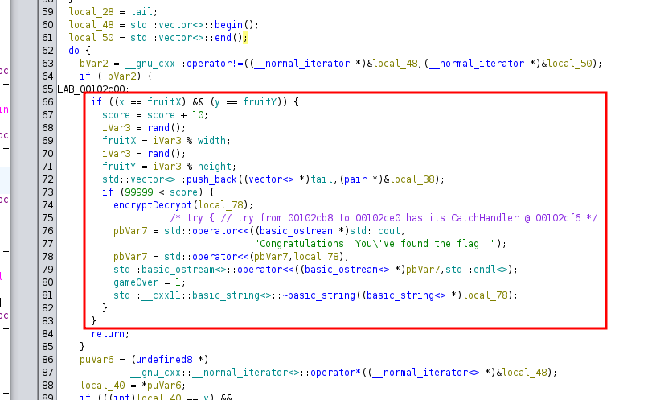
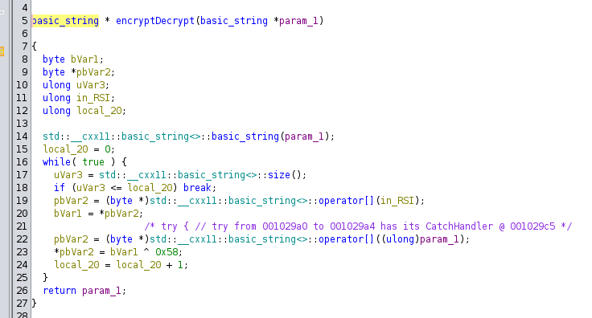
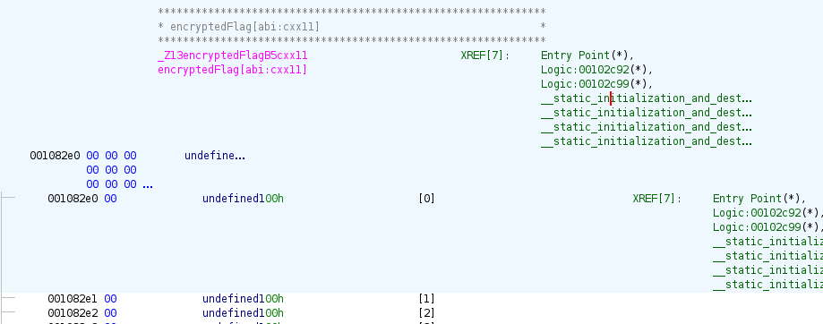
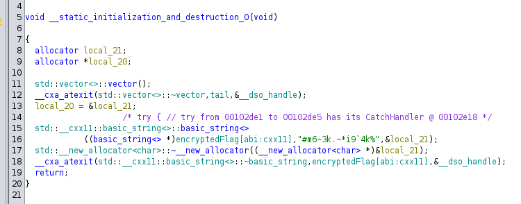

This challenge lets us run an executable locally that contains a custom implementation of the [snake game](https://en.wikipedia.org/wiki/Snake_(video_game_genre)).

<!-- truncate -->

As it is from the pwn category, our first guess might be to find and exploit a vulnerability in the game logic to get the flag.
However, as this challenge is run locally, the flag must be present in some form somewhere in the binary.
Let's first locate the part of the executable responsible for printing the flag when the game is won.



When the user scores 100,000 points and over, the flag first passes through the `encryptDecrypt` function and is then printed to the user.
Looking deeper into this function, it simply xors every byte of the flag with byte 0x58.



To get the flag, we can simply perform the same operation on the string containing the encrypted flag stored statically in the binary.
When trying to locate the flag, we notice the string is not present statically in the executable.



However, looking at the cross-references to this address, it is accessed from a function called `__static_initialization_and_destruction_0`; this looks promising.
Looking at the disassembly, this function initialises the `encryptedFlag` variable with the string ```#m6~3k.~*i9`4k%```.



Let's xor every byte of the encrypted flag with byte 0x59 and see if we get our flag.

```python title="solve.py" showLineNumbers
enc_flag = b'#m6~3k.~*i9`4k%'

flag = b''
for byte in enc_flag:
    flag += int.to_bytes(byte ^ 0x58)

print(flag.decode())
```

The script above yields `{5n&k3v&r1a8l3}` to which we prepend _MCTF_ to get the flag.

In my opinion, this wasn't really a pwn challenge as we managed to solve it without exploiting any vulnerabilities.
An alternative would be to patch the executable to jump to the location where the flag is printed, even though we haven't won the game.
